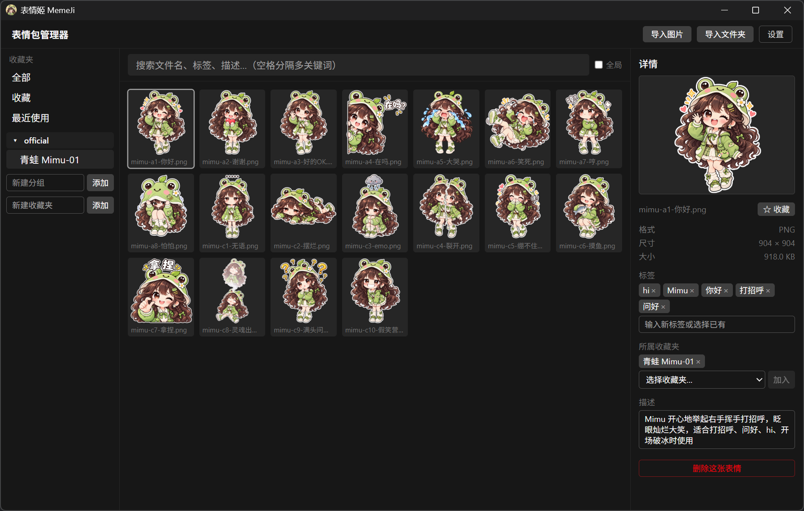
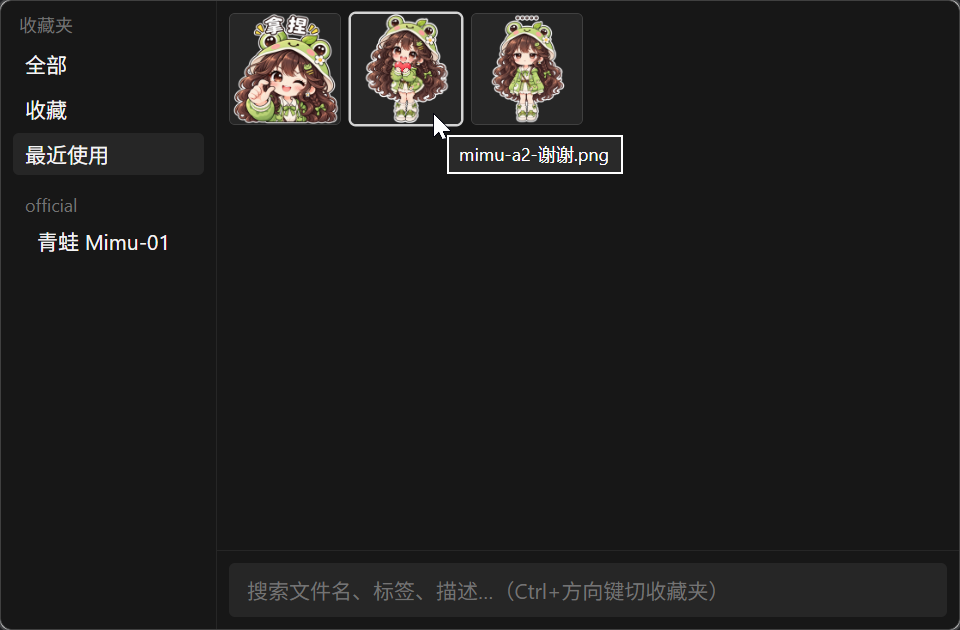
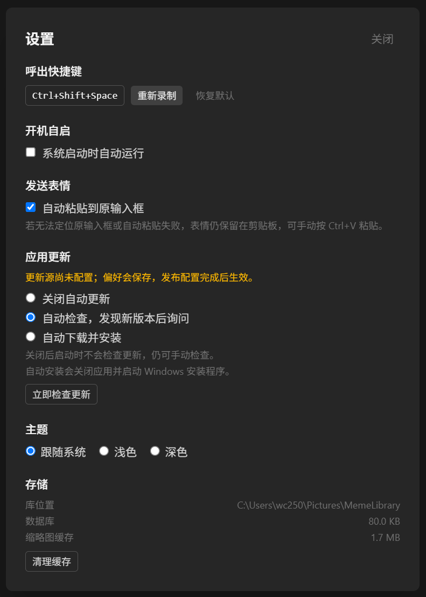

<p align="center">
  
</p>

<h1 align="center">MemeJi（表情姬）</h1>

<p align="center">Windows 本地表情包管理器 · 收藏整理 · Quick Picker · 自动粘贴</p>

MemeJi 是一款 Windows 本地表情包管理器。导入图片后，可以用收藏夹、分类组、标签和描述整理图库，再通过全局快捷键呼出 Quick Picker 搜索、复制并粘贴表情。

## 截图展示

<table>
  <tr>
    <td align="center" width="33%">
      <a href="docs/screenshots/library.png">
        
      </a><br />
      <strong>图库与收藏夹分类</strong>
    </td>
    <td align="center" width="33%">
      <a href="docs/screenshots/quick-picker.png">
        
      </a><br />
      <strong>Quick Picker</strong>
    </td>
    <td align="center" width="20%">
      <a href="docs/screenshots/settings.png">
        
      </a><br />
      <strong>设置</strong>
    </td>
  </tr>
</table>

## 功能

- 托管本地图片库，按内容哈希去重
- 收藏夹支持分组；表情可加入多个收藏夹
- 与资源管理器一致的 Ctrl 点选、Shift 连选、Ctrl+A 和框选；右键批量收藏、标签、删除、加入或移动收藏夹
- 按文件名、标签和描述搜索，并可跨多个收藏夹筛选
- Quick Picker 支持键盘导航、鼠标附近呼出和快速搜索
- Smart Copy 同时写入位图与临时文件引用，兼容不同粘贴目标；动图依靠文件引用保留动画
- 自动粘贴默认开启；仅在 Windows 能确认原输入控件仍可编辑时发送 Ctrl+V
- 内置 Mimu 表情包与系统托盘
- 更新设置支持关闭、检查后询问或自动安装；GitHub 发布源配置见 [更新发布配置](docs/updater-setup.md)

图库和偏好保存在本机，不会上传到服务端。

## Windows 安装

从 [GitHub Releases](https://github.com/wu66chen/MemeJi/releases) 下载 `MemeJi_*_x64-setup.exe`，运行安装程序。

当前安装包尚未使用 Windows Authenticode 代码签名，可能显示 SmartScreen「Windows 已保护你的电脑」和「发布者未知」。确认文件来自本项目 Releases 后，可选择「更多信息 → 仍要运行」（若已显示该按钮则直接选择）。无需关闭 Defender 或 SmartScreen。SHA-256 校验值用于核对文件完整性，不代表安全认证。

可信代码签名需要证书或签名服务；新发布的已签名文件也可能尚未积累信誉。详见 [Microsoft SmartScreen 说明](https://learn.microsoft.com/en-us/windows/apps/package-and-deploy/smartscreen-reputation)。Tauri 自动更新签名与 Windows 代码签名是两套独立机制。

## 批量整理（0.1.3）

- 单击选择一张；Ctrl 点选切换单张，Shift 连选，Ctrl+A 只选择当前结果，也可在空白处拖动框选。
- 右键所选表情可收藏、取消收藏、添加标签、加入或移动收藏夹、删除。删除前会确认数量；失败项会保留选择并显示原因。
- 在具体收藏夹内使用「移动到…」，或把选中的图片拖到左侧目标收藏夹：只移出当前来源，保留其他收藏夹归属。
- 按住 Ctrl 拖放可保留来源。在「全部 / 收藏 / 最近使用」及全库搜索结果中，拖放默认加入目标收藏夹。
- 修改搜索或切换视图会清空选择；Esc 清空选择。导入图片或文件夹时，当前打开的收藏夹会自动收纳导入内容。

## 开发环境

- Windows 10/11
- Node.js 与 pnpm
- Rust stable 工具链
- Tauri 2 所需的 Windows C++ Build Tools 和 WebView2 Runtime

安装依赖并启动开发版：

```powershell
pnpm install
pnpm tauri dev
```

## 验证与打包

```powershell
pnpm check
pnpm test
pnpm build
cargo test --manifest-path src-tauri/Cargo.toml
pnpm tauri build
```

Windows 安装包由 Tauri 生成在 `src-tauri/target/release/bundle/nsis/`。

## 文档

- [自动粘贴的焦点判定与限制](docs/quick-picker-auto-paste.md)
- [GitHub 更新发布配置](docs/updater-setup.md)

## 许可证

本项目基于 MIT License 发布，详见 [LICENSE](LICENSE)。
